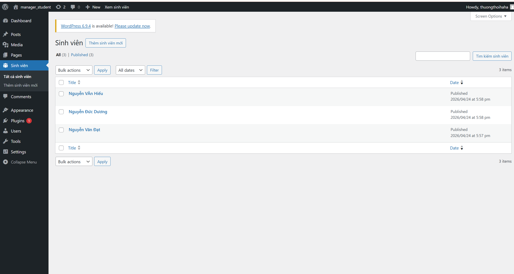
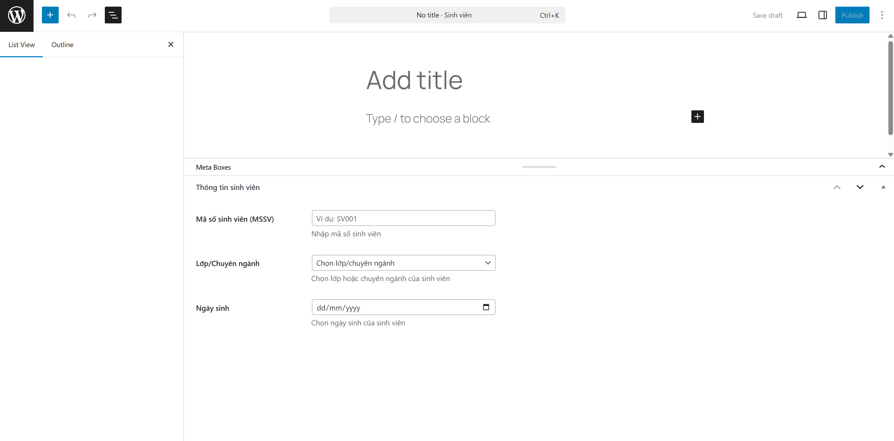
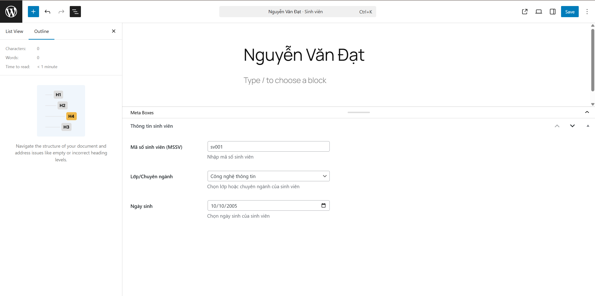
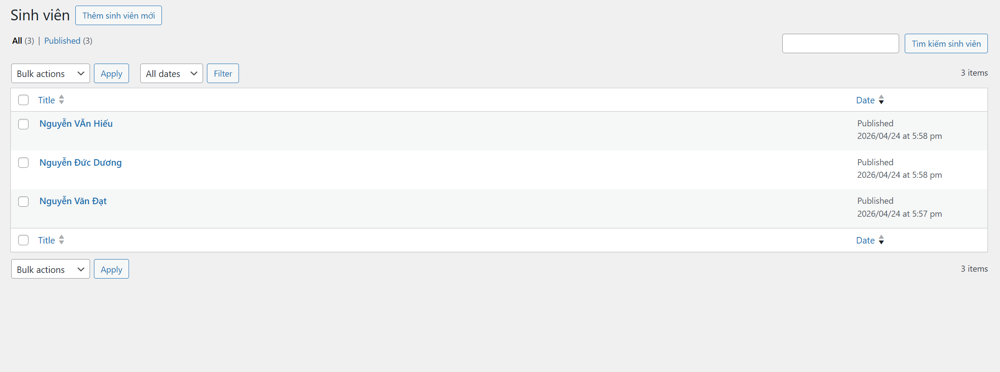
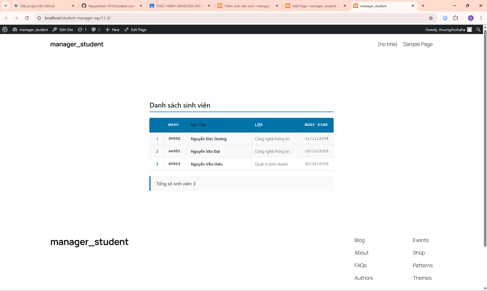

# Student Manager Plugin

Plugin WordPress quản lý thông tin sinh viên với Custom Post Type và hiển thị danh sách qua shortcode.

## Tính năng chính

### A. Quản trị hệ thống (Backend)
- **Custom Post Type "Sinh viên"**: Tạo mục quản lý sinh viên trong admin WordPress
- **Hỗ trợ thuộc tính**: 
  - Title (Họ tên sinh viên)
  - Editor (Tiểu sử/Ghi chú)
- **Custom Meta Boxes** với các trường:
  - Mã số sinh viên (MSSV): Kiểu text
  - Lớp/Chuyên ngành: Kiểu dropdown (CNTT, Kinh tế, Marketing, Kế toán, Quản trị kinh doanh, Ngoại ngữ)
  - Ngày sinh: Kiểu date
- **Bảo mật**: Sử dụng Nonce và Sanitize dữ liệu

### B. Hiển thị dữ liệu (Frontend)
- **Shortcode**: `[danh_sach_sinh_vien]`
- **Hiển thị bảng HTML** với các cột:
  - STT
  - MSSV
  - Họ tên
  - Lớp
  - Ngày sinh

## Cấu trúc thư mục

```
student-manager/
├── student-manager.php          # File chính plugin
├── includes/                    # Logic xử lý
│   ├── class-student-post-type.php
│   ├── class-student-meta-box.php
│   └── class-student-shortcode.php
├── assets/                      # CSS styling
│   └── style.css
└── README.md                    # Tài liệu hướng dẫn
```

## Cài đặt

1. Tải thư mục `student-manager` vào `/wp-content/plugins/`
2. Kích hoạt plugin trong WordPress Admin
3. Truy cập menu "Sinh viên" để quản lý

## Sử dụng

### Thêm sinh viên mới
1. Vào **Sinh viên > Thêm mới**
2. Nhập họ tên trong trường Title
3. Thêm tiểu sử/ghi chú trong Editor
4. Điền thông tin trong Meta Box:
   - Mã số sinh viên
   - Chọn lớp/chuyên ngành
   - Chọn ngày sinh
5. Xuất bản

### Hiển thị danh sách
Thêm shortcode `[danh_sach_sinh_vien]` vào bất kỳ trang nào để hiển thị bảng danh sách sinh viên.

#### Tùy chọn shortcode:
```
[danh_sach_sinh_vien posts_per_page="-1" orderby="title" order="ASC"]
```

- `posts_per_page`: Số lượng sinh viên hiển thị (-1 = tất cả)
- `orderby`: Sắp xếp theo (title, date, menu_order)
- `order`: Thứ tự (ASC, DESC)

## Tính năng bảo mật

- **Nonce verification**: Bảo vệ chống CSRF attacks
- **Data sanitization**: Làm sạch dữ liệu đầu vào
- **Capability checks**: Kiểm tra quyền người dùng
- **Direct access prevention**: Ngăn truy cập trực tiếp file

## Responsive Design

Plugin hỗ trợ hiển thị responsive trên các thiết bị:
- Desktop: Hiển thị đầy đủ tất cả cột
- Tablet: Ẩn cột ngày sinh
- Mobile: Chỉ hiển thị STT, MSSV, Họ tên

## Screenshots

### 1. Menu Admin


### 2. Thêm sinh viên mới


### 3. Meta Box thông tin sinh viên


### 4. Danh sách sinh viên trong admin


### 5. Hiển thị shortcode trên frontend


## Phiên bản
admin
**Version 1.0.0**
- Tạo Custom Post Type "Sinh viên"
- Thêm Meta Box với các trường thông tin
- Tạo shortcode hiển thị danh sách
- Responsive design
- Bảo mật dữ liệu

## Tác giả

Được phát triển theo yêu cầu bài tập WordPress Plugin Development.

## License

GPL v2 or later